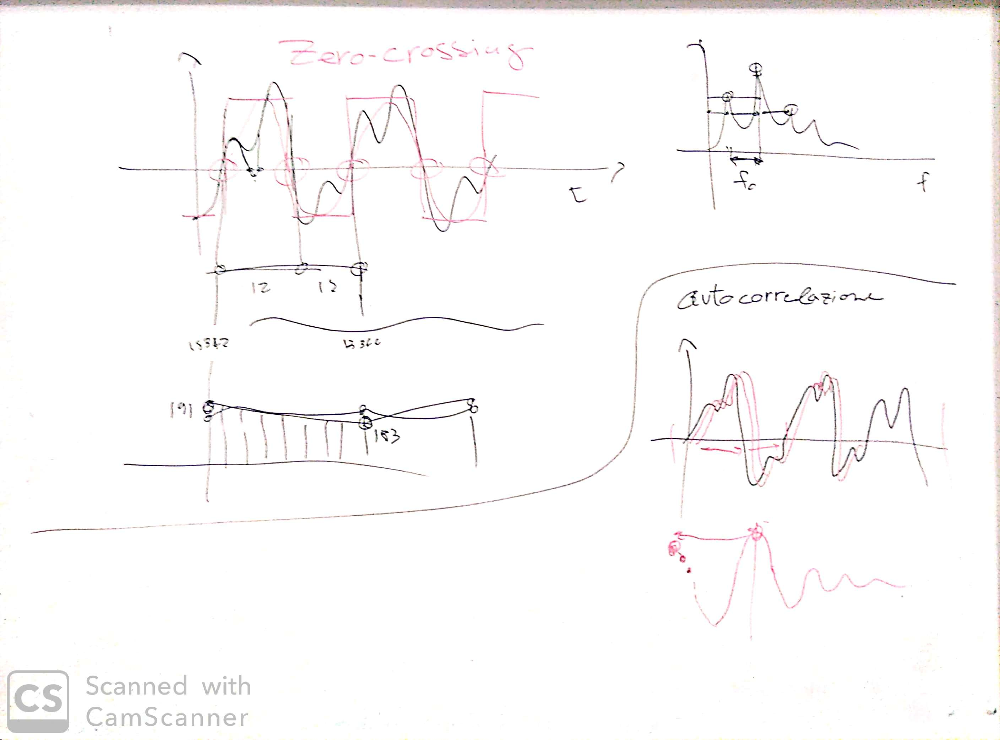
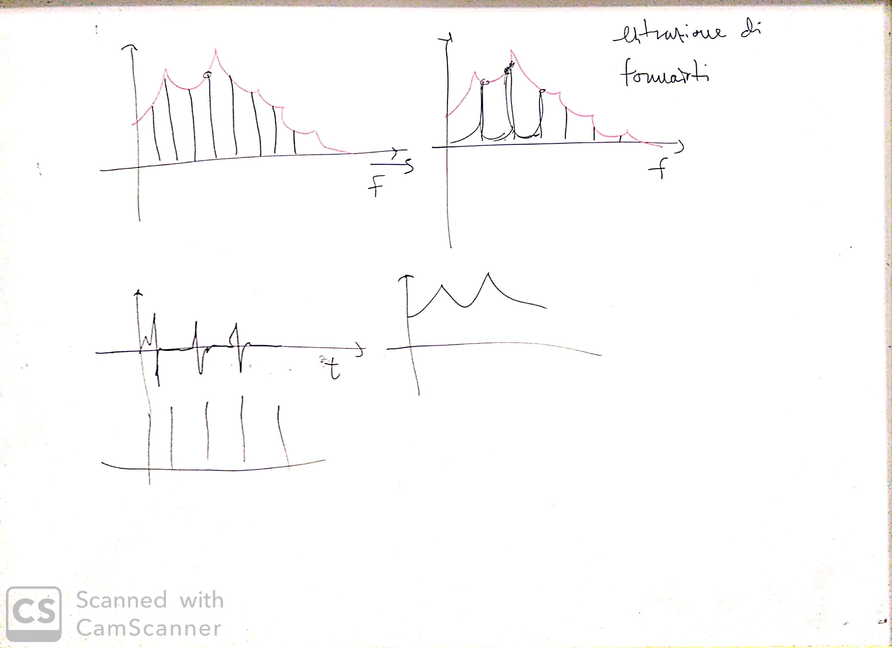

# Lezione di martedì 21 gennaio 2020

## Argomenti

* Discussione del progetto compositivo dello studente:
  * combinazioni di una stessa frase pronunciata in numerosi dialetti del sud Italia
  * discussioni dello strumentario tecnico necessario alla composizione:
    * algoritimi di *pitch detection/extraction*:
      * *zero-crossing*
      * auto-correlazione
    * estrazione di formanti

## Lavagne

