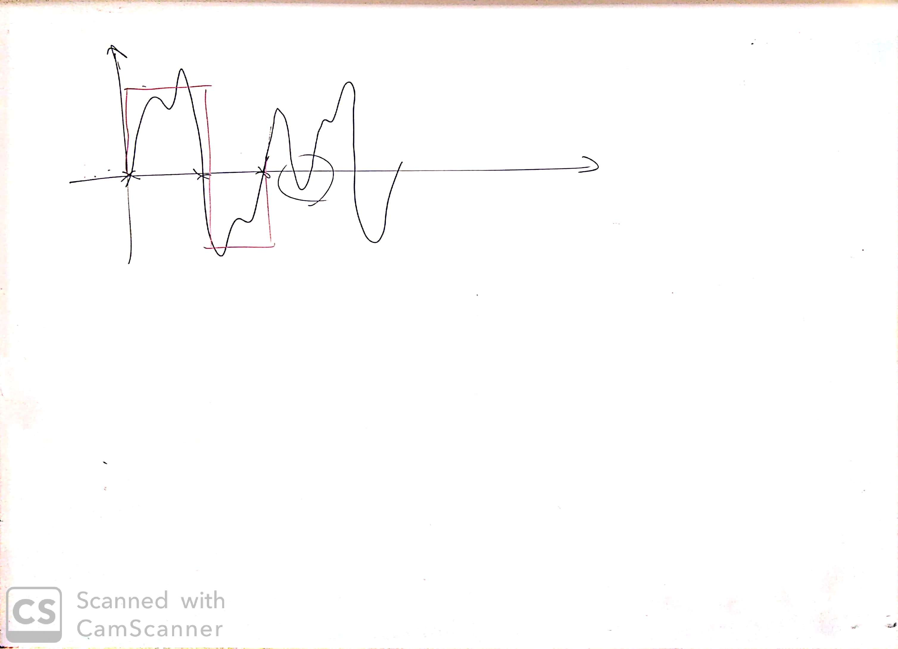

# Lezione di martedì 04 febbraio 2020

## Argomenti

* Discussione del progetto compositivo dello studente:
  * combinazioni di una stessa frase pronunciata in numerosi dialetti del sud Italia
  * discussioni dello strumentario tecnico necessario alla composizione:
    * estrazione di formanti:
      * `LTAS` (*Long-term Averaging Spectrum*) (?)

## Lavagne

